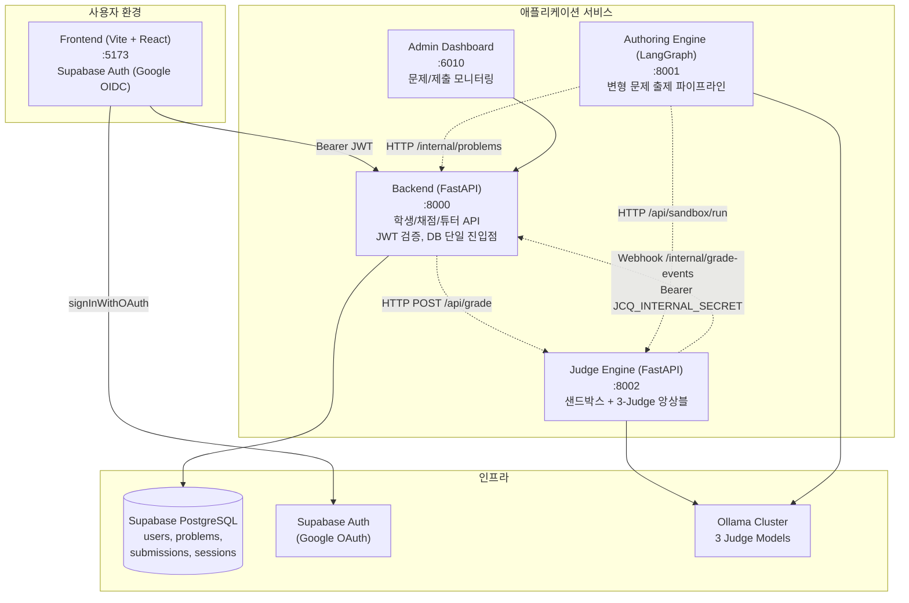
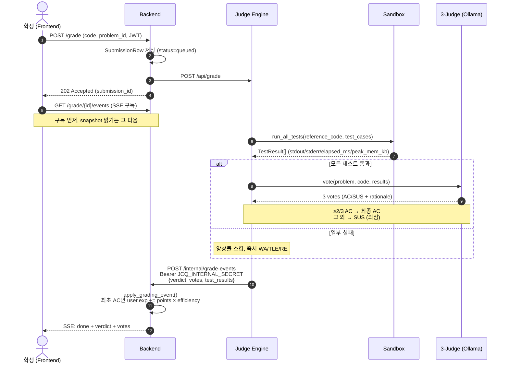
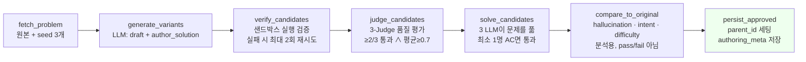
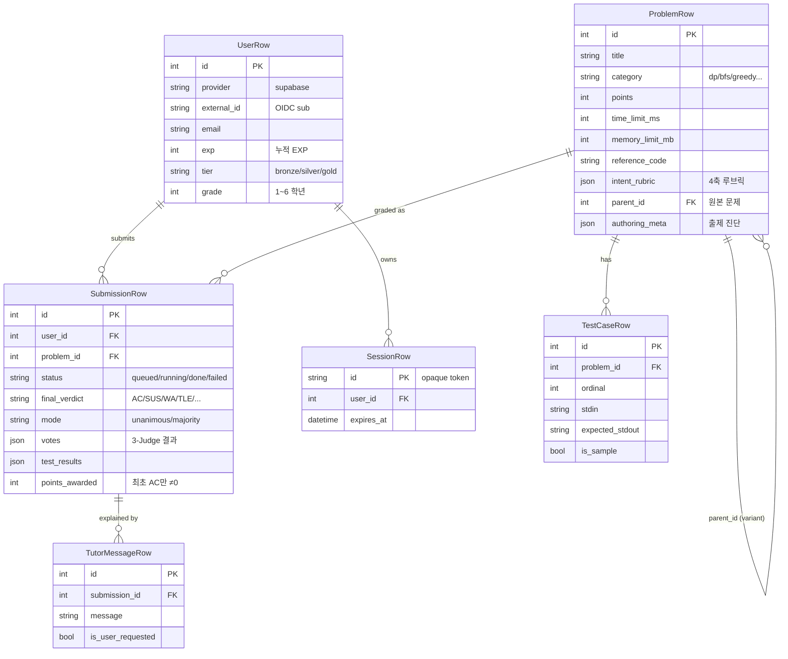

# JCodeQuest — 발표 자료

> 전북대학교 SW경진대회 출품작 · *Algorithm Problem Solving을 Game처럼*
>
> 슬라이드별 스크립트 + 시각화(MermaidJS) 가이드. 각 슬라이드는 `## Slide N` 헤더로 구분.

---

## Slide 1 — 표지

**제목**: JCodeQuest — AI가 출제하고 AI가 채점하는 알고리즘 학습 플랫폼

**부제**: 자동 출제 · 의도 인식 채점 · 게임형 학습

**핵심 한 줄**: "문제 풀이를 게임처럼, 채점은 의도까지."

**발표자/팀명/날짜** *(채워넣기)*

---

## Slide 2 — 왜 만들었나 (배경 · 문제 정의)

### 기존 알고리즘 학습 플랫폼의 한계

- **문제 부족** — 양질의 문제를 사람이 일일이 출제, 변형 문제(같은 개념·다른 데이터) 만들기 어려움
- **채점이 단순** — "테스트케이스 통과 = 정답". 학생이 입력 패턴을 외워 *if/elif 하드코딩*해도 AC
- **재미 없음** — 학습 동기를 이끌 보상 체계(점수·랭킹·티어) 부족

### 우리가 풀려는 문제

1. **출제 자동화** — 원본 문제 1개로부터 변형 문제 5개를 자동 생성
2. **의도 인식 채점** — 코드가 *"의도한 알고리즘"* 으로 풀렸는지 LLM 3인 합의로 판정
3. **게임화** — EXP·효율 가산점·티어·리더보드로 지속적 학습 유도

---

## Slide 3 — 프로젝트 소개

| 항목 | 내용 |
|---|---|
| 이름 | **JCodeQuest** |
| 한 줄 소개 | AI가 출제하고 AI가 채점하는 알고리즘 학습 게임 |
| 대상 | 알고리즘을 게임처럼 배우려는 학생, 변형 문제를 자동 생성하려는 교육자 |
| 차별점 | ① 변형 문제 자동 생성  ② 3-Judge LLM 의도 채점  ③ 효율 가산점 |
| 출품 | 전북대학교 SW경진대회 |

**핵심 가치**
- *"테스트만 통과하면 끝"이 아니다.* — Intent Rubric(4축)으로 풀이 의도까지 평가
- *"문제 하나 만들기가 한 학기 작업"이 아니다.* — LangGraph 7-노드 파이프라인이 검증된 변형 문제를 양산

---

## Slide 4 — 시스템 한눈에 보기 (High-Level Architecture)

**구성**: 3개 서비스 + 공유 DB + 프런트엔드 + 관리자 대시보드



**설계 포인트**
- **세 서비스, 하나의 DB** — backend가 DB의 유일한 진입점. judge·authoring은 모두 backend HTTP로 접근
- **공유 비밀(`JCQ_INTERNAL_SECRET`)** — 내부 서비스 간 Bearer 인증
- **공유 스키마(`jcq-shared`)** — 세 서비스가 같은 Pydantic 모델을 import

---

## Slide 5 — 서비스별 역할

### Backend — `:8000`
- FastAPI. 학생/채점/튜터 API의 단일 진입점
- Supabase JWT(ES256/RS256/HS256) 검증, 세션(`SessionRow`) 관리
- 라우터: `auth`, `me`, `problems`, `grading`, `tutor`, `internal`, `leaderboard`, `notices`
- DB 접근은 backend만이 수행 — judge/authoring은 HTTP로 위임

### Judge Engine — `:8002`
- 비동기 작업 큐(in-process asyncio) — 동시 채점 수 `JCQ_QUEUE_CONCURRENCY`
- **샌드박스** — 순수 Python isolation (`judge/sandbox/runner.py`)
- **3-Judge 앙상블** — Ollama 3개 모델 투표 (`judge/ensemble.py`)
- 채점 결과는 backend `/internal/grade-events` 웹훅으로 회신

### Authoring Engine — `:8001`
- LangGraph 7-노드 DAG로 변형 문제 생성
- CLI(`authoring/main.py`) + HTTP 뷰어(`authoring/server.py`)
- backend·judge에 HTTP로 의존 (자체 DB·실행환경 없음)

### Frontend / Admin Dashboard
- Vite + React 19 + TypeScript 5, Monaco Editor, Tailwind 4
- `@supabase/supabase-js`로 Google OAuth → backend에 Bearer JWT
- Admin: 정적 HTML(Python `http.server`)

---

## Slide 6 — 핵심 흐름: 채점 파이프라인

> 사용자가 "제출" 누르면 4개 시스템이 어떻게 협업하는가



**중요 디테일**
- *Subscribe-before-snapshot* 순서가 깨지면 중간 이벤트 유실 (`api/grading.py:stream_grade_events`)
- 웹훅 실패 시 0.5s → 2s → 6s 재시도, 그래도 실패하면 ERROR 로깅 후 상태가 멈춤
- 제출 쿨다운 기본 10초(`JCQ_SUBMIT_COOLDOWN_S`), 테스트에서는 0으로 강제

---

## Slide 7 — 기획 ① 3-Judge 앙상블 (Evangelion 오마주)

### 왜 3명인가
- 단일 LLM 채점은 **불안정**: 같은 코드에 다른 답
- **3개 다른 모델** + **다른 페르소나**로 합의 → 신뢰도 ↑

| Judge | 모델 | 페르소나 |
|---|---|---|
| **Melchior** | `qwen2.5-coder:14b-instruct-q5_K_M` | 1차 판사 · 가장 엄격, 권위 있음 |
| **Balthasar** | `deepseek-coder-v2:lite` | 코드 리뷰어 관점 · 가독성/안티패턴 |
| **Casper** | `llama3.1:8b` | 교육자 관점 · 루브릭 의도 일치 검사 |

> 이름은 에반게리온의 MAGI 시스템(3현인) 오마주.

### 투표 규칙 (`judge_engine/judge/ensemble.py`)
- 각 판사: `{verdict: AC|SUS, intent_match: bool, rationale, confidence}`
- **AC_RATIO_THRESHOLD = 2/3** → 2명 이상 AC면 최종 AC
- 모드: `unanimous`(3/3 또는 0/3) vs `majority`(2/1)
- 모든 테스트가 통과한 *뒤*에만 앙상블 호출 (실패한 코드는 LLM 부담 X)

### Trade-off
- 비용 = 3× LLM 호출 → Ollama `keep_alive=30m`으로 완화
- 개발/CI: `JCQ_SKIP_ENSEMBLE=1`로 스킵 가능

---

## Slide 8 — 기획 ② Intent Rubric — 4축 채점 루브릭

### 동기: "테스트 통과 ≠ 잘 푼 코드"
학생이 `if n==5: print(120)`로 통과해도 AC? — **No.**
LLM에게 *의도*를 알려줘야 의도 채점이 가능.

### 4축 + 6필드 (`docs/problem-format.md`, `shared/jcq_shared/schemas.py`)

| 축 | 필드 | 의미 | 예시 |
|---|---|---|---|
| Naturalness | `expected_approach` | 의도된 풀이 흐름 | "1..n 누적 곱" |
| Alignment | `key_insight` | 학생이 보여줘야 할 알고리즘 통찰 | "n! = n × (n-1)!, 0! = 1" |
| Complexity | `expected_complexity` | 허용 시간복잡도 클래스 | "O(n)" — O(n²)이면 통과여도 SUS |
| Coverage | `must_handle` | 반드시 처리해야 할 엣지케이스 | ["0! = 1", "n ≤ 20"] |
| Anti-pattern | `forbidden_patterns` | LLM이 잡아야 할 안티패턴 | ["if/elif 직답 매핑"] |

### 검증 (`shared`)
- 모든 필드 비어있지 않아야 출제 가능
- `must_handle`, `forbidden_patterns` 각 1개 이상
- `forbidden_patterns`는 *구체적*이어야 함 ("하드코딩 금지" 같은 추상어 X)

### 효과
- 같은 루브릭이 채점·출제 양쪽에서 사용 → **출제 품질 = 채점 품질**

---

## Slide 9 — 핵심 흐름: 출제 파이프라인 (Authoring)



**노드 특징**
- **Candidate Carrythrough**: 후보를 절대 *제거하지 않고* pass/fail 마킹만 — 어디서 떨어졌는지 추적 가능
- **자체 검증**: 자기가 만든 문제를 자기 LLM이 풀 수 있어야 통과
- **계보 추적**: 변형은 `ProblemRow.parent_id`로 원본과 연결 → 분석/회수 용이

**입력/출력**
- 입력: `--problem-id 12 --count 5`
- 출력: 평균 5개 후보 중 N개가 `status="approved"`로 DB 영속화 (실패 후보는 `authoring_meta`에 남음)

---

## Slide 10 — 데이터 모델 (ERD)



**중요한 설계 결정**
- `(provider, external_id)` Unique — IdP 중복 가입 방지
- `ProblemRow.parent_id` 자기참조 FK — 변형 계보
- 변형 검색 시 `WHERE parent_id IS NULL` (원본만)
- 튜터 메시지는 *덮어쓰지 않고* 히스토리 보존

---

## Slide 11 — 기획 ③ 게임화: EXP · 효율 가산 · 리더보드

### EXP (`backend/src/judge/jobs/grading.py`)
- **최초 AC**에만 EXP 지급 (같은 문제 재AC는 0)
- `points_awarded = int(problem.points × efficiency_multiplier)`

### 효율 가산 (multiplier ∈ [0.5, 1.0])
```python
t_pct = max_test_time / time_limit_ms        # 시간 한도 사용률
m_pct = max_test_mem  / memory_limit_mb_KB   # 메모리 사용률
eff   = 0.5*(1-t_pct) + 0.5*(1-m_pct)        # 효율 점수
multiplier = 0.5 + 0.5 * eff                 # → [0.5, 1.0]
```

| 코드 품질 | 결과 |
|---|---|
| 시간·메모리 모두 ≤ 한도의 50% | `multiplier = 1.0` (만점) |
| 한도 거의 다 씀 | `multiplier ≈ 0.5` (반값) |

> "통과만 시키지 말고 잘 짜라" — 점수로 유인.

### 리더보드 (`api/leaderboard.py`)
- 전체: `UserRow.exp DESC`
- 주간: 이번 ISO 주차 `points_awarded` 합
- 학년별: `grade` 필터 + EXP DESC

### 티어
- `UserRow.tier`: bronze/silver/gold (저장 컬럼 존재, 승급 규칙은 차기 작업)

---

## Slide 12 — 보안 · 격리 · 인증

### 1) 인증 (Auth) — Google OAuth Only
- 자체 비밀번호 *없음*. Supabase Auth가 OIDC 처리
- Frontend: `supabase.auth.signInWithOAuth('google')`
- Backend: JWKS로 JWT 검증 (ES256/RS256/HS256)
- `SessionRow`로 서버측 즉시 로그아웃 지원

> *결정 메모*: 학교 SSO 도입은 검토 후 폐기, Google OIDC 단일 유지

### 2) 내부 서비스 인증
- `JCQ_INTERNAL_SECRET` 공유 — judge ↔ backend, authoring ↔ backend 모두 Bearer 사용
- 422 응답 시 `api_key`, `password`, `secret`, `token` 필드는 자동 `[REDACTED]`

### 3) 샌드박스 — 정직한 한계 인정
- `judge_engine/judge/sandbox/runner.py`: **순수 Python 격리**
- 차단: `socket`, `subprocess`, `ctypes`, `fork`, `exec*` 등 (import 단계)
- 제한: `RLIMIT_AS`, `RLIMIT_CPU`, `RLIMIT_NPROC`, `RLIMIT_FSIZE`
- 출력 캡: stdout/stderr 각 64KB
- **명시적 한계**: seccomp/namespace 격리가 아님. 교육 환경 가정, 대규모 적대 코드 호스팅에는 별도 레이어 필요
- 코드 길이 캡: `MAX_CODE_LENGTH = 64 KB`

---

## Slide 13 — 기술 스택

| 영역 | 기술 |
|---|---|
| **API 서버** | FastAPI 0.115+, Uvicorn, Pydantic v2 |
| **ORM / DB** | SQLModel(SQLAlchemy), Supabase PostgreSQL (개발: SQLite) |
| **Auth** | Supabase Auth (Google OIDC), PyJWT (ES256/RS256/HS256) |
| **LLM 오케스트레이션** | LangChain, **LangGraph** (출제 DAG), LangSmith (트레이싱) |
| **LLM 인퍼런스** | Ollama (self-hosted, 3개 판사 모델) |
| **튜터 LLM** | OpenAI SDK (호환 엔드포인트) |
| **프런트엔드** | React 19, Vite 6, TypeScript 5, Tailwind CSS 4 |
| **에디터** | `@monaco-editor/react`, react-markdown |
| **컨테이너** | Docker Compose (5개 서비스) |
| **공유 스키마** | `jcq-shared` 패키지 (Pydantic) — `file:../shared` editable install |

**Ollama 모델 (필수 3종)**
- `qwen2.5-coder:14b-instruct-q5_K_M` (Melchior)
- `deepseek-coder-v2:lite` (Balthasar)
- `llama3.1:8b` (Casper)

---

## Slide 14 — 핵심 설계 결정 요약

| 결정 | 왜 | 트레이드오프 |
|---|---|---|
| **3 서비스 + 1 DB** | 채점/출제/API의 부하·실패 격리 | HTTP 조율 비용 → 내부 secret + 공유 schema로 완화 |
| **3-Judge 앙상블** | 단일 LLM의 불안정성 보완 | 3× 호출 비용 → keep_alive·테스트 시 스킵 |
| **Intent Rubric (4축)** | 테스트 통과 = AC의 한계 극복 | 출제자에게 정성적 작성 강제 → 출제 품질 자체 향상 |
| **순수 Python 샌드박스** | 운영 단순성, 빠른 반복 | 적대적 등급 격리 아님 → 문서화된 한계, 필요시 OS-레벨 위에 layering |
| **효율 가산 multiplier** | "통과만 하면 끝" 방지 | 학생이 너무 최적화에 빠질 수 있음 → 0.5 하한으로 완화 |
| **`parent_id` 변형 계보** | 자동 출제의 추적·회수 가능 | 자기 참조 FK 다루기 복잡 → 단일 컬럼으로 단순화 |
| **SSE 채점 스트리밍** | WebSocket보다 단순, 프록시 친화 | 단방향 한계 → 채점 알림에는 충분 |
| **Supabase 단일 인증** | 자체 비밀번호 관리 회피 | Supabase 의존 → JWT 검증 로직만 localize |

---

## Slide 15 — 데모 시나리오 (발표용)

### A. 학생 플로우 (3분)
1. 메인 → Google 로그인 → 문제 목록
2. 문제 선택 → Monaco 에디터에서 코드 작성
3. 제출 → **SSE로 실시간** 상태 변화 (queued → running → done)
4. 결과 화면: 판사 3명의 verdict + rationale + 효율 점수
5. 리더보드에서 본인 순위 확인

### B. 관리자 / 출제자 플로우 (2분)
1. 관리자 대시보드(:6010)에서 원본 문제 1개 선택
2. "변형 생성 5개" 실행 → Authoring SSE로 7-노드 진행률
3. 어느 후보가 어디서 떨어졌는지 표시 (verify/judge/solve)
4. 승인된 변형이 `parent_id`로 원본에 매달려 DB 저장

### C. 의도 채점 데모 (1분)
- *나쁜 코드* (`if/elif` 하드코딩) 제출 → 테스트는 통과하지만 **3-Judge가 SUS 판정**
- *좋은 코드* (재귀/누적곱) 제출 → AC + 효율 multiplier 1.0 → EXP 만점

---

## Slide 16 — 향후 과제

- **샌드박스 강화**: Docker/seccomp 격리 layering (대규모 공개 배포 시)
- **티어 승급 규칙**: 현재 컬럼만 존재, 정규화된 승급/강등 룰 필요
- **앙상블 비용 최적화**: 작은 모델 1차 필터 → 큰 모델 확정 등 cascading
- **출제 파이프라인 분석**: `comparison` 점수(hallucination/intent/difficulty)를 통한 모델 튜닝
- **다국어/다언어 지원**: 현재 Python 단일, 점진적 확장
- **소셜·협업 기능**: 풀이 공유, 학급 단위 리그

---

## Slide 17 — 마무리

### 한 줄 요약
> *"AI가 출제하고, AI 3명이 의도까지 채점하며, 학생은 게임처럼 푼다."*

### 핵심 기여
1. **LangGraph 7-노드 자동 출제 파이프라인** — 자기 검증 포함
2. **3-Judge LLM 앙상블 채점** — 의도·복잡도·안티패턴까지 평가
3. **Intent Rubric (4축)** — 출제와 채점을 동일 루브릭으로 묶음
4. **3 서비스 마이크로아키텍처** — 명확한 책임 분리, 단일 DB 진입점

### 질의응답
- 기술 / 기획 / 데모 어느 쪽이든 환영

---

## 부록 A — 디렉터리 구조 (모노레포)

```
JCodeQuest/
├── shared/              # jcq-shared (Pydantic 모델)
├── backend/             # FastAPI :8000 (DB 단일 진입점)
│   └── src/
│       ├── api/         # auth, me, problems, grading, tutor, internal, leaderboard, notices
│       ├── auth/        # supabase_jwt.py
│       ├── judge/       # client.py, jobs/grading.py
│       └── storage/     # models.py, db.py, sessions.py, vault.py
├── judge_engine/        # FastAPI :8002
│   └── judge/
│       ├── sandbox/runner.py   # 순수 Python 격리
│       ├── ensemble.py         # Melchior/Balthasar/Casper
│       ├── callback.py         # 웹훅 회신
│       └── routers/{stats,submissions,users}
├── authoring_engine/    # FastAPI :8001 + LangGraph
│   └── authoring/
│       ├── main.py             # CLI
│       ├── server.py           # HTTP 뷰어
│       └── pipeline/
│           ├── graph.py        # 7-노드 DAG
│           └── nodes/          # fetch, generate, verify, judge, solver, compare, persist
├── frontend/            # Vite + React + TS :5173
├── admin_dashboard/     # 정적 HTML :6010
├── scripts/             # dev.sh, verify_all.py
├── docs/                # 본 문서 포함
└── docker-compose.yml
```

## 부록 B — 참고 문서

- `docs/environment.md` — 환경변수 전체
- `docs/problem-format.md` — IntentRubric 4축 상세
- `docs/authoring-prompt.md` — LLM 프롬프트 사양
- `docs/setup-ollama.md` — Ollama / 3 판사 모델 셋업
- `docs/testing.md` — 테스트 계층 (unit/integration/live/smoke)
- `docs/authoring-engine.md` — 출제 엔진 CLI/HTTP 가이드

## 부록 C — 주요 파일 포인터

| 기능 | 파일 |
|---|---|
| 3-Judge 정의 | `judge_engine/judge/ensemble.py` (JUDGES 상수, `vote()`) |
| 샌드박스 | `judge_engine/judge/sandbox/runner.py` (`_WRAPPER`, `_BLOCKED`) |
| 채점 진입점 | `backend/src/api/grading.py` (`POST /grade`, SSE) |
| 채점 웹훅 | `backend/src/api/internal.py` (`POST /internal/grade-events`) |
| EXP·효율 계산 | `backend/src/judge/jobs/grading.py` (`_efficiency_multiplier`, `apply_grading_event`) |
| 출제 DAG | `authoring_engine/authoring/pipeline/graph.py` |
| Auth JWT | `backend/src/auth/supabase_jwt.py` |
| ORM 모델 | `backend/src/storage/models.py` |
| 공유 스키마 | `shared/jcq_shared/schemas.py` |
